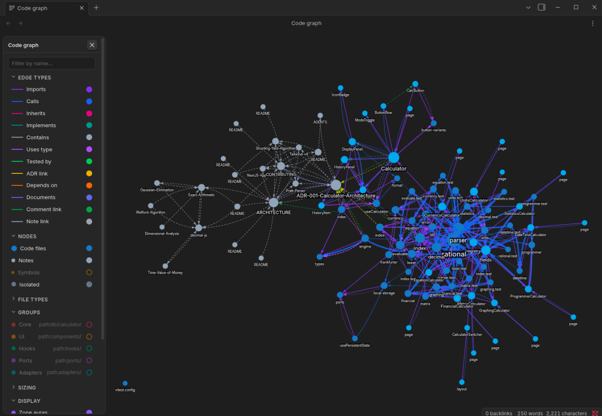

<div align="center">

# Code Graph

**Visualize how your code files connect — imports, calls, inheritance, implements, comment-links, ADRs, and tests — as an interactive graph alongside your notes.**

[](https://github.com/mrjw717/obsidian-code-graph/releases)
[](LICENSE)
[](https://github.com/mrjw717/obsidian-code-graph/actions)
[](https://obsidian.md)

</div>

---



---

<div align="center">

Code Graph turns your vault into a navigable knowledge graph of your codebase.
It parses source files with [tree-sitter](https://tree-sitter.github.io/), extracts
typed relationships, and renders them as a force-directed graph you can explore,
filter, and drill into — right next to your Obsidian notes.

</div>

---

## Features

### Structural analysis

- **AST-parsed edges** — imports, calls, inherits, implements, uses-type, and
  contains relationships, extracted via tree-sitter for TypeScript, TSX,
  JavaScript, and Python.
- **Imports-only support** — regex-based import extraction for CSS, C, C++, Go,
  Rust, Java, Lua, and PHP.
- **Symbol-level nodes** — toggle into functions, classes, methods, interfaces,
  and types as first-class graph nodes inside their containing files.
- **TODO / FIXME visibility** — files with `TODO` comments glow orange; files
  with `FIXME` comments glow red. Technical debt is visible at a glance.

### Documentation protocol

- **`@see`, `@tested-by`, `@adr`, `@depends-on`** tags in code comments become
  typed graph edges connecting code to tests, decisions, and dependencies.
- **`@domain`, `@status`, `@author`** tags become node metadata for coloring,
  filtering, and hover tooltips.
- **Note ↔ code links** — markdown frontmatter `related-code` creates
  `documents` edges from notes to code, closing the loop between documentation
  and implementation.
- **Seed domains command** — one command discovers a domain vocabulary from
  your folder structure and stamps `@file` / `@domain` / `@status` headers
  into code files automatically.

### Interactive graph

- **Color modes** — language, domain, status, or auto-detected community
  (label propagation reveals natural module boundaries).
- **Zone-aura heatmap** — soft colored glows behind nodes, driven by domain,
  community, or user-defined color groups.
- **Color groups** — query-based grouping with `domain:`, `path:`, `ext:`,
  `kind:`, `status:`, `tag:` prefixes or free-text substring.
- **Node sizing** — constant, lines of code, degree, fan-in, or fan-out.
- **Neighborhood filtering** — focus on a file and show only nodes within N
  hops.
- **Dead-code highlighting** — dim nodes with no incoming edges.
- **Hover-focus spotlight** — dim distant nodes/edges on hover to spotlight
  a node's neighborhood.

---

## Edge types

Every edge below is produced **automatically** when code follows ordinary
conventions — static imports, `extends`/`implements`, type annotations, and the
`@tag`/`[[wikilink]]`/frontmatter protocol. Write idiomatic, well-documented
code and the graph fills in. The first six edges come from the AST/regex parser;
the rest come from the documentation protocol.

| Edge | Color | Source | Meaning | Produced by |
|------|-------|--------|---------|-------------|
| imports | `#8b5cf6` | AST / regex | File A imports from file B | `import` / `require` / `#include` / `use` / `@import` |
| calls | `#3b82f6` | AST | File A calls a symbol in file B | call to an exported function/method |
| contains | `#6b7280` | AST | File A contains symbol B | defining a function/class/interface in a file |
| inherits | `#ec4899` | AST | Class A extends class B | `extends` |
| implements | `#14b8a6` | AST | Class A implements interface B | `implements` |
| uses-type | `#a855f7` | AST | Symbol A references type B | type annotation referencing another file's type |
| tested-by | `#22c55e` | `@tested-by` | Code A is verified by test B | `@tested-by [[test-file]]` in a comment |
| adr-link | `#eab308` | `@adr` | Code A is governed by decision B | `@adr [[ADR-note]]` in a comment |
| depends-on | `#f97316` | `@depends-on` | Code A depends on concept B | `@depends-on [[service-or-concept]]` |
| documents | `#6366f1` | frontmatter | Note A documents code B | `related-code: [[file]]` in note frontmatter |
| comment-link | `#16a34a` | `@see` / `[[wikilink]]` | Comment references B | `@see [[X]]`, `[[X]]`, `@link x`, `ref: [[x]]` |
| md-link | `#9ca3af` | Obsidian links | Note A links to note B | `[[wikilink]]` in a note's body |

> For per-edge optimization guidance — exactly what to write to maximize each
> edge honestly — see **§5 Edge-maximization guide** in the
> [skill guide](skills/obsidian-code-graph/skill.md).

## Node types

Nodes come in two layers. **File-level** nodes are always rendered; **symbol**
nodes (shown when **Show symbols** is on) nest inside their containing file via
`contains` edges.

| Node kind | Layer | Color | Produced by |
|-----------|-------|-------|-------------|
| `code` | file | by language (see below) | any file matching a configured code extension |
| `note` | file | note color | any `.md` file (when **Show notes** is on) |
| `other` | file | neutral | any other recognized file |
| `function` | symbol | `#f59e0b` amber | top-level / exported `function` |
| `class` | symbol | `#ef4444` red | `class` declaration |
| `method` | symbol | `#10b981` emerald | method declared inside a class |
| `interface` | symbol | `#a855f7` purple | `interface` declaration |
| `variable` | symbol | `#84cc16` lime | top-level `const` / `let` / `var` |
| `type` | symbol | `#ec4899` pink | `type` alias |
| `enum` | symbol | `#eab308` yellow | `enum` declaration |
| `constant` | symbol | `#14b8a6` teal | named constant |

Symbol nodes are available in **Tier A** languages only (TypeScript, TSX,
JavaScript, Python). Tier B languages produce file-level nodes plus `imports`
edges, and still fully support the `@tag` / `[[wikilink]]` / `TODO` / `FIXME` /
frontmatter protocol. Node fill color follows the active **Color mode**:
language (default), domain (`@domain`), status (`@status`), or auto-detected
community. Symbol colors deliberately avoid blue, which is reserved for file
nodes.

Each node also carries metadata the plugin surfaces: `domain`, `status`,
`author` (hover tooltip), `tags`, `todoCount`/`fixmeCount` (orange/red glow),
and `lines`/fan-in/fan-out (node sizing). Writing the `@tags` and frontmatter
documented in the [skill guide](skills/obsidian-code-graph/skill.md) populates
all of this automatically.

---

## Quick start

1. **Install** — from Obsidian's community plugin browser, or manually copy
   `main.js`, `manifest.json`, and `styles.css` into
   `<vault>/.obsidian/plugins/code-graph/`.
2. **Enable** — in **Settings → Community plugins**.
3. **Open** — click the graph ribbon icon, or run
   **Code Graph: Open graph view** from the command palette.
4. **Tag** (optional) — run **Code Graph: Seed domains from codebase** to
   auto-tag your files with `@domain` / `@status` headers.

---

## The documentation protocol

The plugin ships an **AI-ready skill** — [`skills/obsidian-code-graph/skill.md`](skills/obsidian-code-graph/skill.md) —
that tells AI agents (and humans) exactly how to write code comments, file
headers, and markdown frontmatter so the graph extracts maximum semantic value.
Load it into your AI coding agent, or read it directly. When code adheres to the
protocol below, the graph populates automatically — every `@tag`, `[[link]]`,
and frontmatter field becomes a typed edge or node attribute.

**Code files** — Tier 1 header + typed links:

```typescript
/**
 * @file Calculator engine — math expression evaluation
 * @domain calculator
 * @status stable
 * @author Josh
 *
 * @see [[Shunting Yard Algorithm]]
 * @tested-by [[engine.test.ts]]
 * @adr [[ADR-001-Calculator-Architecture]]
 * @depends-on [[MathEngine]]
 */
```

**Markdown notes** — frontmatter closes the code↔docs loop:

```yaml
---
related-code:
  - "[[engine.ts]]"
domain: calculator
type: adr
status: accepted
tags: [calculator, architecture]
---
```

The [skill guide](skills/obsidian-code-graph/skill.md) contains the full tag
reference, per-edge and per-node optimization guidance, the language support
matrix, a domain auto-detection procedure for AI agents, and a verification
checklist. **Point your AI agent at it** and it will detect your codebase's
domains, offer them as suggestions, and document files to maximize graph edges.

---

## Language support

| Tier | Languages | Edges |
|------|-----------|-------|
| **Full structural** (tree-sitter AST) | TypeScript, TSX, JavaScript, Python | imports, calls, inherits, implements, uses-type, contains, symbol nodes |
| **Imports-only** (regex) | CSS, C, C++, Go, Rust, Java, Lua, PHP | imports only |

The `@tag` / `[[wikilink]]` / `TODO` / `FIXME` / frontmatter protocol works in
**any language** — only the structural edges differ. See the
[skill guide](skills/obsidian-code-graph/skill.md#7-language-support-matrix) for
details on adding a language to the full-structural tier.

---

## Requirements

- **Obsidian 1.7.2 or later.**
- **Desktop only.** The plugin parses source with tree-sitter WASM grammars,
  which is a heavy, desktop-oriented workload that hasn't been validated on
  mobile. (`isDesktopOnly: true` in the manifest.)

---

## Privacy & permissions

Code Graph is **local-first**. It makes **no network requests** and collects
**no telemetry** — all parsing and graph rendering happen entirely inside your
vault. The permissions it does use:

| Permission | Why |
|------------|-----|
| **Reads & writes vault files** | Reads your code/notes via the Obsidian vault API to extract relationships. |
| **Enumerates vault files** | `vault.getFiles()` lists files to discover which ones are code/notes to graph. |
| **Writes to its own plugin folder** | On first run, materializes the bundled tree-sitter WASM grammars into `.obsidian/plugins/code-graph/wasm/` so parsing works. |
| **Clipboard (optional)** | The right-click **Copy path** action writes a file path to the clipboard. User-initiated only. |
| **Bundled WASM / base64** | tree-sitter is embedded as base64 WASM inside `main.js` so fresh installs are self-contained. |

No file outside the vault is read or written.

> **Obsidian Sync note:** `main.js` is ~5.8 MB because the tree-sitter grammars
> are embedded for self-contained installs. **Obsidian Sync Standard** (5 MB
> file cap) will not sync it — use **Sync Plus** or another sync method.

Each release ships with **GitHub artifact attestations** so `main.js`,
`manifest.json`, and `styles.css` can be cryptographically verified against the
source build.

---

## Development

```bash
npm install      # install dependencies
npm run dev      # watch mode — rebuild on save
npm run build    # production build (tsc typecheck + esbuild minified)
npm run lint     # ESLint with eslint-plugin-obsidianmd
npm test         # vitest unit tests (27 tests)
```

### Build pipeline

The build embeds the tree-sitter core runtime and 4 grammar WASM files as
base64 directly into `main.js`, making the plugin fully self-contained. Fresh
installs from a GitHub release need only `main.js`, `manifest.json`, and
`styles.css` — no external downloads or manual extraction.

| Script | Purpose |
|--------|---------|
| `scripts/copy-wasm.mjs` | Copies 4 used grammars + core runtime from `node_modules` to `wasm/` |
| `scripts/embed-wasm.mjs` | Generates `src/indexer/wasm-embedded.ts` with base64 constants |
| `esbuild.config.mjs` | Bundles `src/main.ts` → `main.js` (CJS, minified, tree-shaken) |

### Release artifacts

`main.js`, `manifest.json`, and `styles.css` are attached to GitHub releases
tagged with the version number. The release workflow automatically builds,
attests, and publishes.

---

<div align="center">

---

### Support

If Code Graph saves you time, consider supporting development.

[**Buy me a coffee**](https://buymeacoffee.com/JoshuaWilliams)

---

**License:** 0-BSD · **Author:** Joshua Williams · **Repository:** [mrjw717/obsidian-code-graph](https://github.com/mrjw717/obsidian-code-graph)

</div>